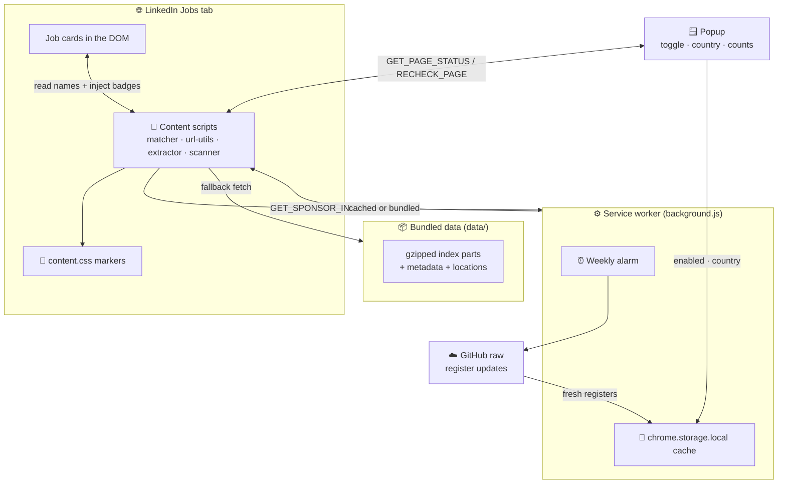
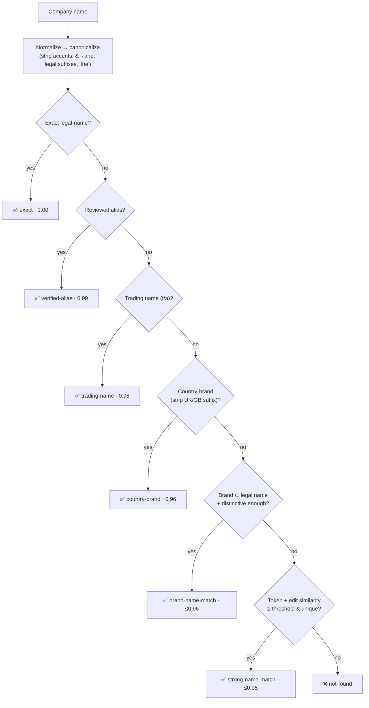

<div align="center">


# 🛂 Visa Sponsorship Checker

### Know who can sponsor your visa — right inside LinkedIn Jobs.

A **privacy-first** Chrome extension that highlights **🇬🇧 UK licensed sponsors** and
**🇳🇱 Netherlands recognised sponsors** directly on LinkedIn job cards, using bundled
**official government registers** — fully offline, with nothing uploaded.

<br />


</div>

---

## 📖 Table of Contents

- [✨ What it does](#-what-it-does)
- [🖼️ At a glance](#️-at-a-glance)
- [🚀 Install locally](#-install-locally)
- [🧠 How it works](#-how-it-works)
- [🎯 The matching engine](#-the-matching-engine)
- [🗂️ Sponsor data & registers](#️-sponsor-data--registers)
- [🔄 Updating the data](#-updating-the-data)
- [🏗️ Project structure](#️-project-structure)
- [🧩 Module reference](#-module-reference)
- [🔐 Permissions](#-permissions)
- [🛡️ Privacy](#️-privacy)
- [🧪 Testing](#-testing)
- [⚙️ Tech & design notes](#️-tech--design-notes)
- [❓ FAQ](#-faq)
- [📜 License](#-license)

---

## ✨ What it does

| | Feature |
|:---:|:---|
| 🟢 | Adds a **soft green marker** when a LinkedIn employer matches the official sponsor register. |
| 🔴 | Adds a **soft red marker** when the employer is **not found**. |
| 🏷️ | Shows the matched **legal organisation name**, the **match method**, the **confidence %**, and **Skilled Worker** route availability (UK). |
| 🧬 | Resolves brand ↔ legal-name differences via **normalization**, **trading-name (`t/a`) extraction**, **strong fuzzy matching**, and a **reviewed alias map**. |
| 📦 | Ships with **bundled registers** and refreshes updated data into local browser storage **once a week**. |
| 🌍 | Includes an **enable/disable switch** and a **🇬🇧 UK / 🇳🇱 Netherlands** country selector. |
| 📍 | **Location-aware** — only checks job cards that match your selected country, so a Dutch role isn't graded against the UK register. |
| 🌗 | Auto-detects LinkedIn's **light/dark theme** and tints markers to match. |
| 🔒 | **100% offline matching** — company names never leave your browser. |

> [!IMPORTANT]
> A positive result means the organisation appears in the selected country's register.
> It does **not** guarantee a particular vacancy will be sponsored. UK badges additionally state
> whether the organisation holds a **Skilled Worker** route in the register.

---

## 🖼️ At a glance

```text
┌──────────────────────────────────────────────────────────┐
│  Senior Data Engineer                                     │
│  Google  🟢 Licensed                ← marker injected     │
│  London, England, United Kingdom · Hybrid                 │
└──────────────────────────────────────────────────────────┘   ║ green rail
┌──────────────────────────────────────────────────────────┐
│  Backend Developer                                        │
│  Tiny Startup Ltd  🔴 Not found     ← marker injected     │
│  Manchester, United Kingdom                               │
└──────────────────────────────────────────────────────────┘   ║ red rail
```

A coloured rail runs down the left edge of each scanned card, the company name is
tinted green/red, and a pill badge with a hover tooltip is appended inline.

---

## 🚀 Install locally

```bash
# 1) Clone the repository
git clone https://github.com/rish-kar/Visa-Sponsorship-Checker.git
```

Then load it as an unpacked extension:

1. Open `chrome://extensions`.
2. Enable **Developer mode** (top-right toggle).
3. Click **Load unpacked** and select the repository folder.
4. Open a **LinkedIn Jobs** search or job-detail page — markers appear automatically.
5. Click the toolbar icon for the popup: toggle on/off, switch country, and see live counts.

> [!TIP]
> The extension only activates on `https://*.linkedin.com/jobs/*`. On any other page the
> popup will say *"Open a LinkedIn Jobs page."*

---

## 🧠 How it works

The extension is a Manifest V3 Chrome extension with three cooperating layers — a **content
script** that reads the page, a **service worker** that keeps data fresh, and a **popup** that
drives settings and surfaces live stats.



### Runtime sequence

1. **Scan** — On load (and on scroll, resize, mutation, and visibility changes), the
   scanner walks the DOM, normalises each job card, and extracts `{ title, company, location }`.
2. **Filter by country** — Cards whose location doesn't classify as the selected country are
   skipped, so the UK register only grades UK roles (and vice versa).
3. **Load the register** — The selected country's index is loaded once: first from the
   service worker's weekly-refreshed cache, otherwise from the **bundled** gzipped parts. The
   `DecompressionStream` API inflates the gzip in the browser.
4. **Match** — Each company name runs through the matching engine (see below) and is cached.
5. **Mark** — A coloured rail, tinted company name, and pill badge with a tooltip are injected.
6. **Report** — The popup polls `GET_PAGE_STATUS` to render *checked / licensed / not-found* counts.

---

## 🎯 The matching engine

The heart of the project is [`src/matcher.js`](src/matcher.js) — a dependency-free,
register-agnostic fuzzy matcher. It first builds an **inverted index** from the dataset
(legal-name map, brand map, trading-name map, token postings, and document frequencies), then
evaluates each company name through a **tiered cascade**, returning on the first confident tier:



### Tiers in detail

| # | Method | Confidence | What it catches |
|:--:|:---|:--:|:---|
| 1 | `exact` | `1.00` | Normalised legal name is identical (`Westcoast Limited` → `Westcoast Ltd`). |
| 2 | `verified-alias` | `0.99` | Hand-reviewed brand → legal entity map (`Google` → `Google (UK) Limited`, `X` → `Twitter UK Ltd`). |
| 3 | `trading-name` | `0.98` | The `t/a` / `trading as` clause (`Deliveroo` → `Roofoods Ltd t/a Deliveroo`). |
| 4 | `country-brand` | `0.96` | Legal name minus a trailing `UK` / `GB` / `United Kingdom` (`Acer` → `Acer UK Limited`). |
| 5 | `brand-name-match` | `≤ 0.96` | Input is a **subset** of the registered name, weighted by IDF coverage (`CGG` → `CGG Services (UK) Ltd`). |
| 6 | `strong-name-match` | `≤ 0.95` | Token overlap (Jaccard + containment) blended with a **Levenshtein** ratio, above threshold and clearly unique. |
| — | `not-found` | `0` | No tier cleared its bar. |

### Guardrails against false positives

The matcher is deliberately conservative — a wrong green badge is worse than a missed one:

- **🧹 Stopwords & legal suffixes** (`ltd`, `limited`, `group`, `services`, `holdings`, …) are stripped so generic words can't carry a match.
- **📍 Place-name rejection** — Lone city/region tokens (`Bristol`, `London`, …) never identify a company, so *"Bristol"* won't match *"H&L Bristol Limited"*.
- **🔢 Single-token rarity cap** — A one-word brand only resolves if that word appears in **≤ 12** organisations (`SINGLE_TOKEN_DF_CAP`), preventing common words from collapsing onto a random firm.
- **📊 IDF weighting** — Rare, distinctive words count far more than frequent ones when scoring coverage.
- **⚖️ Ambiguity rejection** — A fuzzy match must beat the runner-up by a margin (`≥ 0.03`) to win; near-ties are dropped to `not-found`.
- **🪟 Posting-list cap** — Tokens appearing in `> 4000` records are ignored as candidate seeds for performance and precision.

---

## 🗂️ Sponsor data & registers

| | 🇬🇧 United Kingdom | 🇳🇱 Netherlands |
|:---|:---|:---|
| **Source** | UK Visas & Immigration — *Register of licensed sponsors: workers* | Immigration & Naturalisation Service (IND) — *Public register Work* |
| **Label** | *Licensed* (+ Skilled Worker route flag) | *Recognised sponsor* |
| **Organisations** | **126,700** | **12,790** |
| **Skilled Worker routes** | **121,386** | — |
| **Register updated** | 2026-06-26 | 2026-05-08 |
| **Runtime index** | `data/uk-sponsors.index.json.gz.part*` (23 parts) | `data/nl-sponsors.index.json.gz.part*` (3 parts) |
| **Metadata** | `data/metadata.json` | `data/nl-metadata.json` |

### Why the data is split into parts

Each register is built into one compact JSON document, **gzip-compressed**, then sliced into
**50 KB `.part##` chunks**. The chunks are committed to the repo so the extension can ship the
register **bundled** (works offline on first install) while staying within friendly file sizes
for `web_accessible_resources` and GitHub raw downloads. At runtime the parts are concatenated
and inflated with `DecompressionStream("gzip")`.

```text
official CSV/HTML  ──►  build index  ──►  JSON  ──►  gzip  ──►  split into 50 KB parts  ──►  data/*.part##
```

### The location index

[`data/location-index.json`](data/location-index.json) (≈600 KB, sourced from GeoNames) gives
the extractor a large gazetteer of GB and NL place names so it can confidently classify which
country a job card belongs to. It augments the built-in fallback list in the extractor, and is
loaded lazily — if it's missing, matching still works with the built-in towns.

---

## 🔄 Updating the data

The checked-in registers can be refreshed automatically or by hand.

### Automatic (GitHub Actions)

[`.github/workflows/update-sponsor-register.yml`](.github/workflows/update-sponsor-register.yml)
runs **every Sunday at 06:17 UTC** (and on demand via *workflow_dispatch*). It downloads both
official registers, rebuilds the offline indexes, validates the extension, and commits any
changes to `data/`. The extension's service worker then picks up the new data on its own weekly
schedule and caches it in `chrome.storage.local`.

### Manual

```bash
# Rebuild the UK register from GOV.UK
python scripts/update-uk-register.py

# Rebuild the Netherlands register from IND
python scripts/update-nl-register.py
```

Each script downloads the latest official source, builds a **deterministic** gzip (fixed mtime →
reproducible diffs), re-chunks it into parts, and rewrites the matching metadata.

| Script | Role |
|:---|:---|
| [`scripts/update-uk-register.py`](scripts/update-uk-register.py) | Scrapes the GOV.UK publication page for the latest CSV, downloads it, and orchestrates the build. |
| [`scripts/update-nl-register.py`](scripts/update-nl-register.py) | Parses the IND register HTML table (name + 8-digit KvK number) and builds the NL index directly. |
| [`scripts/build-sponsor-index.py`](scripts/build-sponsor-index.py) | Shared builder: de-duplicates organisations, flags Skilled Worker routes, applies the reviewed alias map, and emits the dataset + metadata. |

> [!NOTE]
> The UK builder fails loudly if any alias target is missing from the register, keeping the
> hand-curated alias map honest against each new download.

---

## 🏗️ Project structure

```text
Visa-Sponsorship-Checker/
├── 📄 manifest.json                  # Manifest V3 definition
├── 📄 package.json                   # Scripts: test + validate (no runtime deps)
│
├── 📁 src/                           # Extension runtime
│   ├── background.js                 #   ⚙️ Service worker — alarms, refresh, messaging
│   ├── matcher.js                    #   🎯 Fuzzy matching engine (UMD module)
│   ├── url-utils.js                  #   🔗 LinkedIn URL guards
│   ├── linkedin-extractor.js         #   🔍 Title/company/location extraction + country classify
│   ├── job-list-scanner.js           #   📜 Content script — scans DOM, injects markers
│   └── content.css                   #   🎨 Marker styling (light/dark themes)
│
├── 📁 popup/                         # Toolbar popup UI
│   ├── popup.html                    #   Structure
│   ├── popup.css                     #   Styling (animated gradient, country menu)
│   └── popup.js                      #   Logic — settings, injection, live status
│
├── 📁 scripts/                       # Python data pipeline
│   ├── build-sponsor-index.py        #   CSV → runtime index + metadata
│   ├── update-uk-register.py         #   Fetch GOV.UK CSV → rebuild
│   └── update-nl-register.py         #   Fetch IND register → rebuild
│
├── 📁 data/                          # Bundled offline registers
│   ├── uk-sponsors.index.json.gz.part00..22
│   ├── nl-sponsors.index.json.gz.part00..02
│   ├── metadata.json / nl-metadata.json
│   ├── location-index.json           #   GeoNames GB/NL gazetteer
│   └── uk-sponsors-YYYY-MM-DD.csv.gz  #   Archived source CSV
│
├── 📁 tests/                         # Pure-Node test suite (no framework)
│   ├── matcher.test.js
│   ├── url-utils.test.js
│   ├── linkedin-extractor.test.js
│   ├── job-list-scanner.test.js      #   Includes a hand-rolled fake DOM
│   └── country-data.test.js          #   Validates the real bundled NL index
│
├── 📁 icons/                         # Extension + flag icons
├── 📁 .github/workflows/             # Weekly auto-update CI
├── 📄 PRIVACY.md
└── 📄 LICENSE                        # MIT
```

---

## 🧩 Module reference

### ⚙️ `src/background.js` — service worker

The persistent brain. It schedules a **weekly alarm** (next Sunday 06:17 local, then every 7
days), and on fire downloads each country's metadata + index parts from **GitHub raw**, storing
them base64-encoded in `chrome.storage.local` under a versioned cache schema. It throttles
itself (min 12 h between attempts, skips if data is fresh) and answers content-script /
popup messages:

| Message | Returns |
|:---|:---|
| `GET_SPONSOR_INDEX` | Cached register parts for a country, or `no-cache`. |
| `GET_SPONSOR_METADATA` | Cached metadata only (counts, dates). |
| `REFRESH_SPONSOR_DATA` | Forces a refresh cycle. |

### 🎯 `src/matcher.js` — matching engine

A UMD module (works in the browser **and** under Node for tests) exposing
`buildIndex(dataset)` and `matchCompany(index, name)` plus the normalisation helpers
(`baseNormalize`, `canonicalize`, `significantTokens`, `legalNameKey`, `tradeNameKey`).
Pure, deterministic, and dependency-free. See [the matching engine](#-the-matching-engine).

### 🔍 `src/linkedin-extractor.js` — page understanding

Turns noisy card text into clean fields. Strips LinkedIn chrome (*Easy Apply*, *Promoted*,
*"2 weeks ago"*, work-mode chips, salary lines), chooses the most likely company line, extracts
job IDs from attributes/URNs/URLs, and — crucially — **classifies a location line as GB, NL, or
neither** using explicit country terms, an unsupported-country blocklist, and the location
gazetteer.

### 📜 `src/job-list-scanner.js` — content script

The orchestrator injected into LinkedIn. Notable engineering:

- **🔁 Self-versioning & hot-reload safe** — A `VERSION` guard means re-injecting the script just
  triggers a rescan instead of double-binding listeners; an old runtime is cleanly torn down.
- **🧲 Robust card detection** — Dozens of resilient selectors plus a `cardLike()` heuristic
  (size, visibility, line count, job-ID signals) survive LinkedIn's frequent DOM churn.
- **⏱️ Debounced scanning** — `MutationObserver` + scroll/resize/load/visibility listeners feed a
  90 ms debounced scan, with staged re-scans (250/900/1800/3200 ms) to catch lazy content.
- **🌗 Theme detection** — Infers light/dark from class hints or computed background luminance.
- **🧠 Match cache** — Per-country, per-canonical-name memoisation avoids rework while scrolling.

### 🪟 `popup/` — control surface

A polished dark UI with an animated gradient backdrop. Handles the **enable toggle**, an
accessible **country selector** (custom listbox + native `<select>` fallback, full keyboard
support), a **rescan** button, and live **checked / licensed / not-found** counts. Switching
country reloads the active LinkedIn tab so the correct register is applied, and shows register
metadata (organisation count + last-updated date) pulled from cache or bundled metadata.

---

## 🔐 Permissions

| Permission | Why it's needed |
|:---|:---|
| `storage` | Saves the enabled state, selected country, and the locally cached registers. |
| `activeTab` | Lets the popup request a recheck of the current LinkedIn Jobs tab. |
| `scripting` | Injects the content scripts / CSS when the popup needs to (re)attach them. |
| `alarms` | Schedules the weekly register refresh. |
| `host: *.linkedin.com/jobs/*` | Reads employer names and injects the visual markers. |
| `host: raw.githubusercontent.com/rish-kar/Visa-Sponsorship-Checker/*` | Downloads updated register JSON parts into local storage. |

---

## 🛡️ Privacy

> [!IMPORTANT]
> Company names are matched **entirely on your device**. Nothing about your browsing or the jobs
> you view is ever transmitted.

- ❌ **No** browsing history, job data, or personal data is sent anywhere.
- ❌ **No** analytics, advertising SDKs, or remote scripts.
- ✅ Only the enabled state, selected country, and cached register data are stored — via `chrome.storage.local`.
- ✅ The single outbound request is the **weekly register refresh** from this repo's GitHub raw host. It carries **no** LinkedIn company names, job details, or personal data.

Full text: [PRIVACY.md](PRIVACY.md).

---

## 🧪 Testing

The suite is pure Node — **no framework, no dependencies** — using `node:assert`. The scanner
test even ships a hand-rolled **fake DOM** to exercise the content script end-to-end, and the
country-data test validates the **real** bundled Netherlands index.

```bash
# Run all unit tests
npm test

# Tests + syntax checks for JS and Python sources
npm run validate

# Sanity-check the manifest JSON
python -m json.tool manifest.json > /dev/null
```

| Test | Covers |
|:---|:---|
| `matcher.test.js` | Every matching tier, aliases, place-name rejection, ambiguity. |
| `url-utils.test.js` | LinkedIn Jobs URL detection across hosts/paths. |
| `linkedin-extractor.test.js` | Company-line selection, job-ID parsing, country classification. |
| `job-list-scanner.test.js` | Full scan → mark → recount flow against a fake DOM, incl. country switch. |
| `country-data.test.js` | Decompresses and matches against the shipped NL register. |

---

## ⚙️ Tech & design notes

- **🧱 Manifest V3** service-worker architecture — no persistent background page.
- **📦 Zero runtime dependencies** — vanilla JS modules; Python only for the offline data pipeline.
- **🔌 UMD modules** — `matcher`, `url-utils`, and `linkedin-extractor` load identically in the browser and under Node, so the same code is unit-tested directly.
- **🗜️ Browser-native gzip** via `DecompressionStream` — no bundled inflate library.
- **♿ Accessibility** — ARIA roles, keyboard-navigable country menu, and `prefers-reduced-motion` handling throughout.
- **🔁 Determinism** — register builds use fixed gzip mtime so identical data produces identical bytes (clean diffs, reproducible CI).

---

## ❓ FAQ

<details>
<summary><b>Does a green badge guarantee my job will be sponsored?</b></summary>

No. It means the employer's organisation appears in the official register for the selected
country. Individual vacancies may or may not offer sponsorship — always confirm with the
employer. For the UK, the badge also tells you whether the organisation holds a **Skilled
Worker** route.
</details>

<details>
<summary><b>Why is a company I know is a sponsor showing as "Not found"?</b></summary>

LinkedIn may show a brand/trading name that differs from the registered legal entity, or the
match may be too ambiguous to confirm safely (the matcher errs toward *not-found* over a wrong
green). Known brand→entity gaps can be added to the alias map in
[`build-sponsor-index.py`](scripts/build-sponsor-index.py).
</details>

<details>
<summary><b>Does it work offline?</b></summary>

Yes. The registers are bundled with the extension, so matching works on first install with no
network. The weekly GitHub refresh only swaps in newer data when available.
</details>

<details>
<summary><b>Which pages does it run on?</b></summary>

Only `https://*.linkedin.com/jobs/*`. It does nothing on the rest of LinkedIn or any other site.
</details>

---

## 📜 License

Released under the **[MIT License](LICENSE)** © 2026 Rishabh Kar.

<div align="center">

---

**Data sources:** 🇬🇧 [UK Visas & Immigration](https://www.gov.uk/government/publications/register-of-licensed-sponsors-workers) · 🇳🇱 [IND Public Register Work](https://ind.nl/en/public-register-recognised-sponsors/public-register-work)

Made with care for job-seekers navigating visa sponsorship.

</div>
